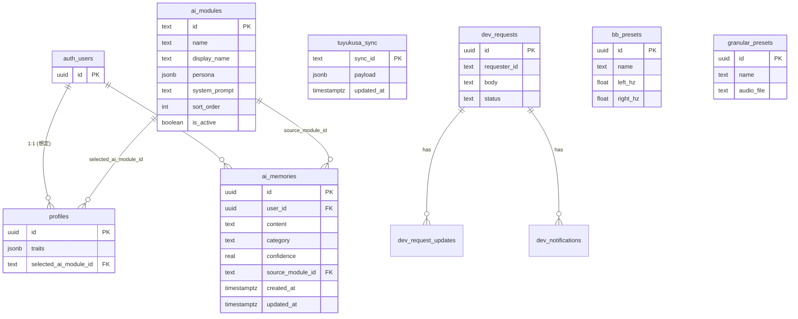
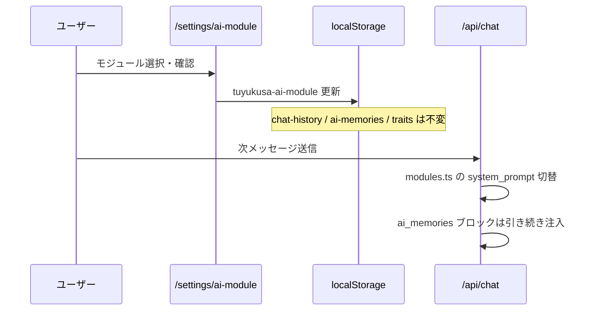

# つゆくさアプリ 全体設計書 v1.0

> リポジトリ: `tuyukusa-app`（GitHub: `tomoyoshidate-alt/tuyukusa-app`）  
> Supabase プロジェクト名: **Tsuyukusa AD**  
> 最終更新: 2026-07-09（コードベース `main` ブランチ準拠）

---

## 1. コンセプト

### 1.1 プロダクト定義

**タスク管理アドバイスマネージャー** — 日々のタスク・生活リズム・体調を、AIが伴走しながら整えるモバイルファーストの PWA。

**東西医学統合** — つゆくさ医院・伊達伯欣（Tomoyoshi Date）が提唱する漢方・養生の知恵を、現代の生活リズム設計（タスク・スケジュール・環境データ）と統合する。アプリ内 AI ペルソナは「**ともせんせい**」（伊達AI モジュール群）として提供される。

### 1.2 中核思想（2つ）

| 思想 | 意味 | 実装での体現 |
|------|------|--------------|
| **AIは差し替え可能、ユーザーの人格データは不変** | 専門分野（モジュール）を切り替えても、記録・学習・体質は引き継ぐ | Layer B（モジュール）と Layer A（traits / memories / 記録）の分離。`selected_ai_module_id` 変更時も `ai_memories`・チャット履歴・traits はクリアしない |
| **家族は1つの体** | 世帯単位の見守り・連携を将来設計の中心に置く | Layer D（つながり層）は未実装。`ai_memories.category = 'family'` で家族文脈の学習枠のみ準備 |

---

## 2. 4層アーキテクチャ

```
┌─────────────────────────────────────────────────────────────┐
│  D. つながり層（未実装）                                      │
│     家族世帯・医院連携（→ docs/clinic-integration.md）         │
├─────────────────────────────────────────────────────────────┤
│  C. アプリシェル                                              │
│     Next.js 16 PWA / タブ・設定ルート / API Routes             │
├─────────────────────────────────────────────────────────────┤
│  B. AIモジュール（差し替え可能）                               │
│     3モジュール（general / adhd / kafun）＋将来ヒーラー author  │
├─────────────────────────────────────────────────────────────┤
│  A. ユーザーコア（不変）                                       │
│     traits / memories / 記録 / タスク / スケジュール            │
└─────────────────────────────────────────────────────────────┘
```

### Layer A — ユーザーコア

| データ | 保存先（現状） | Supabase（Tsuyukusa AD） |
|--------|----------------|--------------------------|
| `profiles.traits`（地域・体質等） | `tuyukusa-user-traits`（localStorage） | `profiles.traits` JSONB（`supabase/profiles_traits.sql`） |
| `ai_memories` | `tuyukusa-ai-memories`（localStorage） | `ai_memories` テーブル（`supabase/ai_memories.sql`）※Auth 連携前はローカル正 |
| `profiles.selected_ai_module_id` | `tuyukusa-ai-module`（localStorage） | `profiles` カラム（`supabase/ai_modules.sql`） |
| チャット履歴・学習 | `tuyukusa-chat-history`, `tuyukusa-chat-knowledge` | `tuyukusa_sync.payload` 経由の JSON 同期 |
| タスク | `tuyukusa-local-tasks` + Notion 連携 | **`tasks` テーブルは本リポジトリに未定義** |
| 体調・記録 | `tuyukusa-health-data`, スケジュール等 | 同上（localStorage → sync） |
| `test_results` | **未実装** | **本リポジトリにスキーマ・コードなし**（将来 Layer A） |

一括バックアップ: `tuyukusa_sync` テーブルに `sync_id` + `payload`（JSONB）で localStorage エクスポートを upsert（`src/lib/supabaseSync.ts`）。

### Layer B — AIモジュール

| ID | 名称 | 用途 |
|----|------|------|
| `date-general-v1` | 伊達AI（汎用養生）🌿 | 起床・食事・入浴・睡眠 |
| `date-adhd-v1` | 伊達AI（ADHD）📝 | タスク整理・持ち物・バッファ時間 |
| `date-kafun-v1` | 伊達AI（花粉症）🌸 | 花粉×体質・外出前ケア |

- **定義**: `src/lib/ai/modules.ts`（実行時の正）+ `ai_modules` テーブル（参照・シード）
- **ペルソナ**: 全モジュール共通「ともせんせい」（`src/lib/ai/persona.ts`）
- **将来**: 世界中のヒーラーが `author` としてモジュールを提供するマーケットプレイス構想（未実装）

### Layer C — アプリシェル

**現在有効な UI（2026-07 時点）**

| 領域 | 状態 | 備考 |
|------|------|------|
| チャット（AI） | ✅ 有効 | 下部ナビ・デスクトップサイドバー |
| バイノーラル | ✅ 有効 | 同上 |
| ホーム / サウンド / 履歴 / 画面 / 連携 / 設定（SPA 内） | ⏸ legacy | `page.tsx` で `{false && ...}` により非表示 |
| `/settings` | ✅ 有効 | 専門・地域・メモリへの入口 |
| `/settings/ai-module` | ✅ 有効 | モジュール切替 |
| `/settings/memories` | ✅ 有効 | 学習メモリ管理 |
| `/dev-requests` | ✅ 有効 | 開発依頼 |
| `/mac` | ✅ 有効 | Mac Studio サブアプリ |

**設計上の6タブ**（タスク / AI / おでかけ / テスト / サウンド / 設定）のうち、**テスト・おでかけ専用タブは未実装**。タスクは localTasks + Notion、テストは `test_results` 未着手。

### Layer D — つながり層

- 家族世帯アカウント: **未実装**
- 医院連携: **設計のみ** → [clinic-integration.md](./clinic-integration.md)

---

## 3. データベース一覧（Tsuyukusa AD）

### 3.1 テーブル一覧

| テーブル | 定義場所 | 用途 | RLS |
|----------|----------|------|-----|
| `profiles` | **外部**（本 repo は ALTER のみ） | ユーザー基本情報・`traits`・`selected_ai_module_id` | （プロジェクト側で設定想定） |
| `ai_modules` | `supabase/ai_modules.sql` | AI モジュールカタログ | active のみ anon/authenticated 読取 |
| `ai_memories` | `supabase/ai_memories.sql` | 会話から学習した事実 | 本人のみ CRUD |
| `tuyukusa_sync` | `supabaseSetupWizardSteps.ts` 内 SQL | 端末間 JSON 同期 | anon all（要本番硬化） |
| `dev_requests` | `supabase/dev_requests.sql` | 開発依頼 | anon all（要本番硬化） |
| `dev_request_updates` | 同上 | 依頼更新履歴 | 同上 |
| `dev_notifications` | 同上 | 依頼通知 | 同上 |
| `bb_presets` | `supabase/studio_presets.sql` | バイノーラルプリセット | anon 読書 |
| `granular_presets` | 同上 | グラニュラープリセット | anon 読書 |
| `tasks` | **未定義** | （設計上 Layer A） | — |
| `test_results` | **未定義** | （設計上 Layer A） | — |

**Storage バケット**: `attachments`（開発依頼）、`audio`（Studio 音源）

### 3.2 ER 図（Mermaid）



> `profiles`・`auth.users` は Supabase Auth 標準。本リポジトリには `CREATE TABLE profiles` は含まれない。

---

## 4. 主要フロー

### 4.1 AI モジュール切替（Layer B 変更、Layer A 不変）



### 4.2 朝のブリーフィング

1. AI タブ表示 → `MorningBriefingCard` が当日キャッシュ確認  
2. 未生成なら `POST /api/briefing`（モジュール別コンテキスト + 環境 API + memories）  
3. `claude-sonnet-4-6` で 300 字以内生成 → `tuyukusa-daily-briefing` に保存  

### 4.3 AI メモリ自動抽出

1. 自由会話（`chatFlowStep === "free"`）で AI 応答完了  
2. 非同期 `POST /api/memories/extract`（10 分に 1 回）  
3. 抽出 → 重複整理（new / duplicate / update）→ localStorage 保存  
4. 以降の chat / briefing で `■ この方についてこれまでに学んだこと`（最大 30 件）を system prompt に付与  

### 4.4 環境データ（差し替え可能プロバイダー）

- `src/lib/environment/` — Open-Meteo（天気・Geocoding 連携）
- 花粉: 月＋風速＋降水の**スタブ**（有償 API 差し替え予定）

---

## 5. API Routes 一覧

| Route | 用途 |
|-------|------|
| `POST /api/chat` | AI 相談（Haiku） |
| `POST /api/briefing` | 朝ブリーフィング（Sonnet 4.6） |
| `POST /api/memories/extract` | メモリ抽出（Sonnet 4.6） |
| `POST /api/daily-message` | 日次メッセージ |
| `GET /api/weather` | 天気（Open-Meteo プロキシ） |
| `GET/POST /api/notion` | Notion タスク・スケジュール |
| `POST /api/notion/parse-voice` | 音声タスク解析 |
| `GET /api/google-calendar` | iCal 連携 |
| `POST /api/claude` | 汎用 Claude プロキシ |
| `GET /api/radio-episodes` | ラジオエピソード |

---

## 6. 新モジュール追加手順

### 6.1 目標（将来）

**モジュール定義の追加のみ**で UI・切替・プロンプト注入が動作し、**アプリコードの分岐追加が不要**であること。

### 6.2 現状とのギャップ

| 項目 | 目標 | 現状 |
|------|------|------|
| モジュール定義 | DB / 設定ファイルのみ | **`src/lib/ai/modules.ts` にハードコード**（実行時の正） |
| シード | SQL のみ | SQL は参照用プレースホルダ、**prompt 本文は TS 側** |
| UI カード | 自動列挙 | `DATE_AI_MODULES` 配列から生成（✅ 定義追加で UI 反映可） |
| ブリーフィング分岐 | モジュール ID 駆動 | `briefing/context.ts` に **switch 文**（新 ID 時は要追加） |
| DB シード | 自動 | **手動 SQL 実行**が必要 |

### 6.3 現時点での追加手順

1. `src/lib/ai/modules.ts` に `AiModule` 定義を追加（`system_prompt`・persona は共通 `TOMOSENSEI_PERSONA` 可）  
2. `supabase/ai_modules.sql` の INSERT に同 ID を追加（SQL Editor 実行）  
3. ブリーフィング用に `src/lib/briefing/context.ts` の `buildBriefingDataContext` に分岐が必要なら追加  
4. `npm run build` で型・ビルド確認  

---

## 7. 品質・安全ガイドライン

| 原則 | 実装 |
|------|------|
| **診断行為をしない** | プロンプト・抽出指示で「憶測・診断名を出さない」「明言された事実のみ」 |
| **緊急時は受診誘導** | 花粉・体調モジュールで「受診を検討していい」トーン（命令・警告色なし） |
| **「たい・いい」の言語哲学** | `persona.ts`・ブリーフィング指示で命令形回避を明記 |
| **メモリの透明性** | `/settings/memories` でユーザーが閲覧・削除可能 |
| **レート制限** | メモリ抽出 10 分 / 1 回 |

---

## 8. 実装状況マップ

| 機能 | 状態 |
|------|------|
| AI 3 モジュール切替 | ✅ 実装済 |
| 朝のブリーフィング | ✅ 実装済 |
| AI メモリ自動抽出・管理 UI | ✅ 実装済 |
| 環境プロバイダー（Open-Meteo + 花粉スタブ） | ✅ 実装済 |
| localStorage + tuyukusa_sync 同期 | ✅ 実装済 |
| Supabase Auth（匿名 + Google linkIdentity） | ❌ 未実装（コードベースに auth 呼び出しなし） |
| ai_memories の DB 双方向同期 | ❌ 未実装（localStorage 正） |
| profiles / tasks / test_results 正規テーブル | ❌ 未実装 or リポジトリ外 |
| 6 タブ UI（おでかけ・テスト含む） | ❌ 未実装（legacy 非表示） |
| 家族アカウント（Layer D） | ❌ 未実装 |
| プッシュ通知 | ❌ 未実装 |
| 決済 | ❌ 未実装 |
| 医院連携 | 📄 設計 v0.1 のみ |
| 花粉 API 有償版 | ❌ スタブのみ |

---

## 9. 関連ドキュメント

- [医院連携 設計書 v0.1](./clinic-integration.md)
- マイグレーション: `supabase/*.sql`（Tsuyukusa AD の SQL Editor で個別実行）
