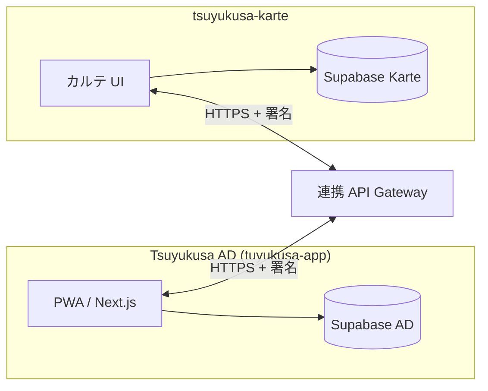

# つゆくさアプリ × 医院連携 設計書 v0.1

> ステータス: **ドラフト（未実装）**  
> 関連: [architecture.md](./architecture.md) Layer D  
> カルテ側リポジトリ想定: **tsuyukusa-karte**（別 Supabase プロジェクト）

---

## 1. 目的

| 方向 | 内容 |
|------|------|
| **医院 → アプリ** | 診察情報（証・処方・生活指導・次回予約）をユーザーの Layer A に反映 |
| **アプリ → 医院** | 日々の記録を **AI 生成の 300 字要約**として、診察前に本人がプレビュー・明示送信 |
| **家族** | 世帯ぐるみの見守り（Phase 4）。中核思想「家族は1つの体」の Layer D 実装 |

---

## 2. 基本原則

| # | 原則 |
|---|------|
| 1 | **すべてオプトイン** — 連携はユーザー（または保護者）が明示的に開始する |
| 2 | **同意は方向別に独立** — 「医院から受け取る」「医院へ送る」は別トグル・別履歴 |
| 3 | **アプリ → 医院は要約のみ** — チャット生ログ・`ai_memories` 全文は**送らない** |
| 4 | **いつでも取り消し** — 紐付け解除・送信停止・受信停止を設定から可能 |
| 5 | **AI は診療行為ではない** — 緊急時は受診誘導。診断名の確定・処方指示は医院側の責務 |
| 6 | **別プロジェクト間連携** — Tsuyukusa AD（アプリ）と tsuyukusa-karte（カルテ）は **Auth 共有しない**。API + 短期リンクコードで橋渡し |

---

## 3. 紐付け方式

### 3.1 院内発行リンクコード

| 項目 | 仕様 |
|------|------|
| 形式 | **8 桁**英数字（読み間違い回避のため O/0, I/1 除外推奨） |
| 有効期限 | **30 分** |
| 使用回数 | **1 回限り**（成功紐付け後に失効） |
| 提示 | 受付・診察室タブレットで **QR** 表示 |
| 入力 | アプリ `/settings/clinic-link`（将来）でコード入力 or QR スキャン |

### 3.2 紐付け後の状態

- アプリ側: `clinic_sync` レコード（下記ドラフト）に `clinic_id`・`patient_ref`（カルテ側の匿名参照 ID）を保存  
- カルテ側: 対応する `app_user_ref` を保持（メールアドレス等の直接共有は最小化）

---

## 4. データマッピング

### 4.1 医院 → アプリ

| カルテ項目 | アプリ反映先 | 備考 |
|------------|--------------|------|
| 証（辨証） | `profiles.traits` または専用 `clinic_notes` | ユーザー向けに平易化した文案 |
| 処方 | Layer A 記録（将来 `prescriptions`） | 薬剤名・服薬タイミング。服薬リマインド連携は Phase 2+ |
| 生活指導 | スケジュールテンプレート / タスク提案 | REFLECT_SCHEDULE 相当の構造化データ |
| 次回予約 | ローカルスケジュール + リマインド | Phase 1 で通院リマインド |

### 4.2 アプリ → 医院

| 送信内容 | 形式 | フロー |
|----------|------|--------|
| 期間要約（例: 直近 2 週間） | **300 字以内日本語** | AI 生成 → **本人プレビュー** → 「送信する」明示操作 |
| 含めないもの | — | 生チャット、`ai_memories`  raw、位置情報の詳細座標 |

要約プロンプトは [architecture.md](./architecture.md) の安全ガイドライン（診断しない・たい/いい）に準拠。

---

## 5. 技術方式

### 5.1 システム境界



- **同一 Auth 共有はしない**（プロジェクト・RLS・責務分離）
- 連携 API は **サーバー間**（Edge Function または専用 BFF）。anon key 直呼び禁止
- ペイロードは **最小限の匿名参照 ID** + 暗号化 channel を推奨

### 5.2 ドラフト SQL（適用しない — 設計メモ）

以下は Tsuyukusa AD 側の案。**本番適用前にセキュリティレビュー必須**。

```sql
-- ── clinic_link_codes: 院内発行の一時コード ──
-- 実際の INSERT は tsuyukusa-karte 側 API 経由を想定

create table if not exists public.clinic_link_codes (
  id uuid primary key default gen_random_uuid(),
  code char(8) not null unique,
  clinic_id text not null,
  patient_ref text not null,          -- カルテ側の匿名患者参照
  expires_at timestamptz not null,
  used_at timestamptz,
  created_at timestamptz not null default now(),
  check (expires_at > created_at)
);

create index if not exists clinic_link_codes_code_idx
  on public.clinic_link_codes (code)
  where used_at is null;

-- ── clinic_sync: 紐付け済みユーザー ──

create table if not exists public.clinic_sync (
  id uuid primary key default gen_random_uuid(),
  user_id uuid not null references auth.users(id) on delete cascade,
  clinic_id text not null,
  patient_ref text not null,
  receive_enabled boolean not null default false,
  send_enabled boolean not null default false,
  linked_at timestamptz not null default now(),
  revoked_at timestamptz,
  unique (user_id, clinic_id)
);

alter table public.clinic_link_codes enable row level security;
alter table public.clinic_sync enable row level security;

-- RLS 例（詳細は Auth 導入後に確定）:
-- clinic_sync: auth.uid() = user_id のみ
-- clinic_link_codes: 直接 anon 読取禁止。Redeem API のみ

comment on table public.clinic_sync is
  'App user ↔ clinic link. Receive/send toggles are independent opt-ins.';
```

カルテ側（tsuyukusa-karte）には対称的に `app_link_codes` 発行ログ・Webhook 受信エンドポイントを置く想定。

---

## 6. 段階的リリース

| Phase | 内容 | 依存 |
|-------|------|------|
| **Phase 1** | 8 桁コード紐付け + **通院リマインド**（次回予約をアプリ通知/スケジュール反映） | Supabase Auth、プッシュ or ローカル通知 |
| **Phase 2** | **証・処方・生活指導**の医院 → アプリ反映 | カルテ API スキーマ確定、マッピング実装 |
| **Phase 3** | **300 字要約**のアプリ → 医院送信（プレビュー必須） | `/api/clinic/summary` 等、監査ログ |
| **Phase 4** | **世帯見守り**（家族代表が要約受信・同意管理） | Layer D 家族アカウント |

---

## 7. 現状との関係

| 項目 | 状態 |
|------|------|
| 本ドキュメントのテーブル | **未作成・未適用** |
| アプリ内医院設定 UI | **未実装** |
| `clinic_link_codes` / `clinic_sync` | **ドラフトのみ** |
| Layer A データ | localStorage 中心（[architecture.md](./architecture.md) 参照） |
| tsuyukusa-karte API | **別リポジトリ・別設計**（本 doc では境界のみ定義） |

---

## 8. オープン課題

1. 要約生成モデル・プロンプトの医院向け監査要件  
2. 個人情報保護法・医療情報の取扱いに基づく保存期間  
3. 家族代表者の法定代理権限の UI 表現  
4. 紐付け失効・医院側の患者 ID 変更時の再リンクフロー  

---

## 9. 改訂履歴

| 版 | 日付 | 内容 |
|----|------|------|
| v0.1 | 2026-07-09 | 初版ドラフト（コード未実装） |
